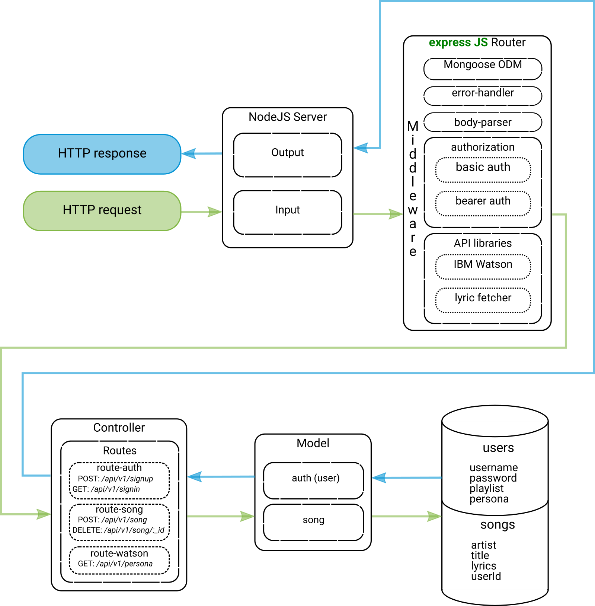

# Personality Paragrapher Back-End
[](https://travis-ci.org/PersonalityParagrapher/PersonalityParagrapherBackend)

Personality Paragrapher is RESTful API that defines personality traits of a playlist created by a user. The user must create an account and add to a playlist by typing in the artist and song title. When the user performs a `GET` request for their playlist personality, it will return an object with percentages of how the playlist matched on 5 characteristics.

---

## Installing and Getting Started

### Installing
This application is available without installing the repository by navigating to the [deployed application site](https://personality-paragrapher-prod.herokuapp.com).

If you would prefer to install on your local computer:

Fork and git clone this repository to your local computer, navigate to the root directory of the repository and run `npm i` in the command line, this will install all necessary packages.

### Getting Started

#### Create User/Sign Up:

```http
http POST https://personality-paragrapher-prod.herokuapp.com/api/v1/signup username=<username> password=<password> email=<email>
```

#### User Sign In:
```http
http -a <username>:<password> GET https://personality-paragrapher-prod.herokuapp.com/api/v1/signin
```

#### Add a Song to User Playlist:
```http
http POST https://personality-paragrapher-prod.herokuapp.com/api/v1/song title='<song title>' artist='<artist>' 'Authorization:Bearer <user token>'
```

Example:
```json
{
    "_id": "5a85c45125d2fed5ea5fb490",
    "title": "All Star",
    "artist": "Smash Mouth",
    "lyrics": "<Lyrics removed from example to save space>",
    "userId": "5a85c3cd25d2fed5ea5fb48e",
    "__v": 0
}
```

#### Get Songs from Playlist:
```http
http GET https://personality-paragrapher-prod.herokuapp.com/api/v1/song 'Authorization:Bearer <user token>'
```

Example:
```json
[
    {
        "_id": "5a85c41825d2fed5ea5fb48f",
        "title": "Thriller",
        "artist": "Michael Jackson",
        "lyrics": "<Lyrics removed from example to save space>",
        "userId": "5a85c3cd25d2fed5ea5fb48e",
        "__v": 0
    },
    {
        "_id": "5a85cf37dfccfbd9758bc8b4",
        "title": "All Star",
        "artist": "Smash Mouth",
        "lyrics": "<Lyrics removed from example to save space>",
        "userId": "5a85c3cd25d2fed5ea5fb48e",
        "__v": 0
    }
]
```

#### Delete a Song from Playlist:
```http
http DELETE https://personality-paragrapher-prod.herokuapp.com/api/v1/song/<song ID> 'Authorization:Bearer <user token>'
```

#### Get Personality of Playlist:
```http
http GET https://personality-paragrapher-prod.herokuapp.com/api/v1/persona 'Authorization:Bearer <user token>'
```

Example of Returned Playlist Personality (condensed):
```json
{
    "word_count": 503,
    "word_count_message": "There were 503 words in the input. We need a minimum of 600, preferably 1,200 or more, to compute statistically significant estimates",
    "processed_language": "en",
    "personality": [
        {
            "trait_id": "big5_openness",
            "name": "Openness",
            "category": "personality",
            "percentile": 0.86036219472133,
            "children": [
                {
                    "trait_id": "facet_adventurousness",
                    "name": "Adventurousness",
                    "category": "personality",
                    "percentile": 0.8631363794556252
                }
        ]}
        ],
    "needs": [
        {
            "trait_id": "need_challenge",
            "name": "Challenge",
            "category": "needs",
            "percentile": 0.18020541781633714
        }
        ],
    "values": [
        {
            "trait_id": "value_conservation",
            "name": "Conservation",
            "category": "values",
            "percentile": 0.19013852895736638
        }
        ],
    "consumption_preferences": [
        {
            "consumption_preference_category_id": "consumption_preferences_shopping",
            "name": "Purchasing Preferences",
            "consumption_preferences": [
                {
                    "consumption_preference_id": "consumption_preferences_automobile_ownership_cost",
                    "name": "Likely to be sensitive to ownership cost when buying automobiles",
                    "score": 0
                }]
        }
        ],
    "warnings": [
        {
            "warning_id": "WORD_COUNT_MESSAGE",
            "message": "There were 503 words in the input. We need a minimum of 600, preferably 1,200 or more, to compute statistically significant estimates"
        }
    ]
}
```

---

## Data Structures



### Routes
* `route-auth`
  * `POST` request for user sign up
  * `GET` request for user sign in
* `route-song`
  * `POST` request to add song to playlist once run through `lyric-fetcher` middleware
  * `DELETE` request to delete a song from a playlist and remove its relationship to the user
* `route-watson`
  * `GET` request passes playlist lyrics through Watson API and returns the personality insights of the playlist

### Models
* `auth` - creates a user, hashes the password, stores songs to a 'playlist' array
* `song` - creates a song object with an artist name, song title and lyrics, then related to a user

### Library
* `server` - establishes app setup, hooks up middleware, start and stop server methods
* `watson` - populates the user's playlist with songs added by user, collects all lyrics from each song and passes through Watson Personality Insights API
* `error-handler` - generates error messages based on error object text
* `basic-auth-middleware` - determines if user is authentic when signing in and provides a token
* `bearer-auth-middleware` - determines if user is authorized to perform http requests when signed in, returns a token if user is authorized


---

## Collaborators

|Daniel Logerstedt  | Melanie Downing | Yohanes Demissie  | Steven Carpenter  |
|:-----------------:|:---------------:|:-----------------:|:-----------------:|
| |  |  |  |
| [GitHub](https://github.com/daniellogerstedt) / [Linked In](https://www.linkedin.com/in/logerstedt/) | [GitHub](https://github.com/sayanything830) / [Linked In](https://www.linkedin.com/in/melanie-downing/) | [GitHub](https://github.com/YohanesDemissie) / [Linked In](https://www.linkedin.com/in/yohanes-demissie-11024a155/) | [GitHub](https://github.com/stevegcarpenter) / [Linked In](https://www.linkedin.com/in/carpentersteven/) |

